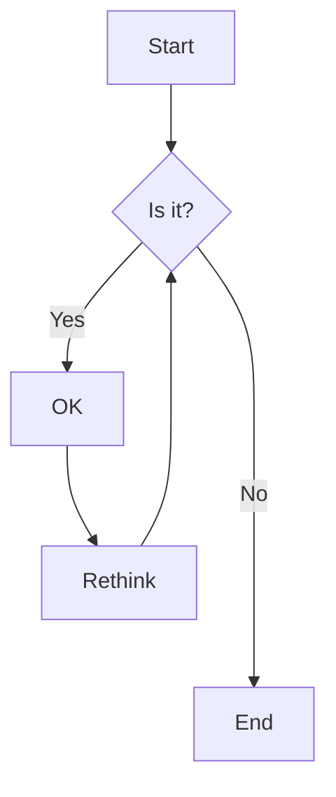

第一篇Hugo搭建的网站上的博客, 包含用Hugo的原因和对Hugo上Markdown的测试

<!--more-->

# 用Hugo的原因

1. 理由一: 速度
   
   使用过hexo, 但是该框架搭建于`node.js`之上, 所以拉各种包体验很差, 编译静态页面体验不佳
   
2. 理由二: 更新

   hexo感觉更新很慢, 拉node的module还报些security involuntary与deprecated, 让强迫症无语

# 各种Markdown特性测试

## 目录

<!--[TOC]-->

## 公式

### 行内公式
这是一个行内公式$E=mc^2$

### 行间公式

#### 质能公式

$$
E=mc^2
$$

#### 麦克斯韦方程组

$$
\begin{align*}
\nabla\cdot\vec{E} &= \frac{\rho}{\epsilon_0} \\
\nabla\cdot\vec{B} &= 0 \\
\nabla\times\vec{E} &= -\frac{\partial B}{\partial t} \\
\nabla\times\vec{B} &= \mu_0\left(\vec{J}+\epsilon_0\frac{\partial E}{\partial t} \right)
\end{align*}
$$

## 代码块

```python
for i in range(0, 10):
    print(i)
```
## 图片


## 嵌入Html

### 嵌入shortcodes

#### Bilibili

下面是一个测试视频iframe


配了半天, 不懂css真让人头大

在layouts/shortcodes下新建bilibili.html

```html
<style>
    .bilibili {
        position: relative;
        width: 100%;
        height: 0;
        padding-bottom: 56.25%;
        overflow: hidden;
    }
    .bilibili iframe {
        position: absolute;
        width: 100%;
        height: 100%;
        overflow: hidden;
        left: 0;
        top: 0;
    }
    /* @media only screen and (min-device-width: 320px) and (max-device-width: 480px) {
      #bilibili {
        width: 100%;
        height: 250px;
      }
    } */
</style>

<div class="bilibili">
    {{ $videoID := index .Params 0 }}
    {{ $pageNum := index .Params 1 | default 1}}
    
    {{ if (findRE "^[bB][vV][0-9a-zA-Z]+$" $videoID) }}
    <iframe id="biliplayer" src="//player.bilibili.com/player.html?bvid={{ $videoID }}&page={{ $pageNum }}" 
        scrolling="no" border="0" frameborder="no" framespacing="0" allowfullscreen="true" 
        loading="lazy" > </iframe>
    {{ else }}
    <iframe id="biliplayer" src="//player.bilibili.com/player.html?aid={{ $videoID }}&page={{ $pageNum }}"
        scrolling="no" border="0" frameborder="no" framespacing="0" allowfullscreen="true" 
        loading="lazy" > </iframe>
    {{ end }}
</div>
```

#### youtube

下面是一个测试视频iframe


#### raw


<h5>test</h5>


#### admonition



<p>
一个笔记横幅, echo<br>
中文测试
</p>



{}
biu biu biu.<br>
br br br
{}

{}
biu biu biu. biu biu biu. biu biu biu. biu biu biu. biu biu biu. biu biu biu. biu biu biu. biu biu biu. biu biu biu. biu biu biu. 
{}

{}
biu biu biu.
{}

{}
biu biu biu.
{}

{}
biu biu biu.
{}

{}
biu biu biu.
{}

{}
biu biu biu.
{}

{}
biu biu biu.
{}

{}
biu biu biu.
{}

{}
biu biu biu.
{}

{}
biu biu biu.

{}
biu biu biu.
{}

{}
Without title.
{}

{}


#### default


{}
#### center

{}

{}
#### right

{}

{}
#### left

{}

#### music



## 注释

这里使用了注释[^1]

A footnote on "label"[^label]

The footnote for definition[^!DEF]

A footnote with link[^pa]

## 表格


|      | 年龄 | 职业    |
| ---- | ---- | -------|
| 小明 | 10   | Student |
| 小红 | 11   | Student |
| 小绿 | 12   | Student |

```Markdown
| _Colors_      | Fruits          | Vegetable         |
| ------------- |:---------------:| -----------------:|
| Red           | *Apple*         | [Pepper](#Tables) |
| ~~Orange~~    | Oranges         | **Carrot**        |
| Green         | ~~***Pears***~~ | Spinach           |
```

| _Colors_      | Fruits          | Vegetable    |
| ------------- |:---------------:| ------------:|
| Red           | *Apple*         | Pepper       |
| ~~Orange~~    | Oranges         | **Carrot**   |
| Green         | ~~***Pears***~~ | Spinach      |

| Class or Enum    | Year                                            | Month                                           | Day                                             | Hours                                           | Minutes                                         | Seconds*                                        | Zone Offset                                     | Zone ID                                         | toString Output                             | Where Discussed                                                                                     |
|------------------|-------------------------------------------------|-------------------------------------------------|:-----------------------------------------------:|:-----------------------------------------------:|:-----------------------------------------------:|-------------------------------------------------|:-----------------------------------------------:|:-----------------------------------------------:|---------------------------------------------|-----------------------------------------------------------------------------------------------------|
| `Instant`        |                                                 |                                                 |                                                 |                                                 |                                                 | <center></center> |                                                 |                                                 | `2013-08-20T15:16:26.355Z`                  | [Instant Class](https://docs.oracle.com/javase/tutorial/datetime/iso/instant.html)                  |
| `LocalDate`      | <center></center> | <center></center> | <center></center> |                                                 |                                                 |                                                 |                                                 |                                                 | `2013-08-20`                                | [Date Classes](https://docs.oracle.com/javase/tutorial/datetime/iso/date.html)                      |
| `LocalDateTime`  | <center></center> | <center></center> | <center></center> | <center></center> | <center></center> | <center></center> |                                                 |                                                 | `2013-08-20T08:16:26.937`                   | [Date and Time Classes](https://docs.oracle.com/javase/tutorial/datetime/iso/datetime.html)         |
| `ZonedDateTime`  | <center></center> | <center></center> | <center></center> | <center></center> | <center></center> | <center></center> | <center></center> | <center></center> | `2013-08-21T00:16:26.941+09:00[Asia/Tokyo]` | [Time Zone and Offset Classes](https://docs.oracle.com/javase/tutorial/datetime/iso/timezones.html) |
| `LocalTime`      |                                                 |                                                 |                                                 | <center></center> | <center></center> | <center></center> |                                                 |                                                 | `08:16:26.943`                              | [Date and Time Classes](https://docs.oracle.com/javase/tutorial/datetime/iso/datetime.html)         |
| `MonthDay`       |                                                 | <center></center> | <center></center> |                                                 |                                                 |                                                 |                                                 |                                                 | `--08-20`                                   | [Date Classes](https://docs.oracle.com/javase/tutorial/datetime/iso/date.html)                      |
| `Year`           | <center></center> |                                                 |                                                 |                                                 |                                                 |                                                 |                                                 |                                                 | `2013`                                      | [Date Classes](https://docs.oracle.com/javase/tutorial/datetime/iso/date.html)                      |
| `YearMonth`      | <center></center> | <center></center> |                                                 |                                                 |                                                 |                                                 |                                                 |                                                 | `2013-08`                                   | [Date Classes](https://docs.oracle.com/javase/tutorial/datetime/iso/date.html)                      |
| `Month`          |                                                 | <center></center> |                                                 |                                                 |                                                 |                                                 |                                                 |                                                 | `AUGUST`                                    | [DayOfWeek and Month Enums](https://docs.oracle.com/javase/tutorial/datetime/iso/enum.html)         |
| `OffsetDateTime` | <center></center> | <center></center> | <center></center> | <center></center> | <center></center> | <center></center> | <center></center> |                                                 | `2013-08-20T08:16:26.954-07:00`             | [Time Zone and Offset Classes](https://docs.oracle.com/javase/tutorial/datetime/iso/timezones.html) |
| `OffsetTime`     |                                                 |                                                 |                                                 | <center></center> | <center></center> | <center></center> | <center></center> |                                                 | `08:16:26.957-07:00`                        | [Time Zone and Offset Classes](https://docs.oracle.com/javase/tutorial/datetime/iso/timezones.html) |
| `Duration`       |                                                 |                                                 | \**                                             | \**                                             | \**                                             | <center></center> |                                                 |                                                 | `PT20H` (20 hours)                          | [Period and Duration](https://docs.oracle.com/javase/tutorial/datetime/iso/period.html)             |
| `Period`         | <center></center> | <center></center> | <center></center> |                                                 |                                                 |                                                 | \***                                            | \***                                            | `P10D` (10 days)                            | [Period and Duration](https://docs.oracle.com/javase/tutorial/datetime/iso/period.html)             |


## 引用


> 这是引用的文本内容


## 加粗

**粗体文字, 看见了吗**

## 斜体

*斜体文字, 看见了吗*

## 删除线

~~删除线~~

## 超链接

[百度](www.baidu.com)

## 列表

### 有序

1. 第一手
2. 第二条
3. 第三次

### 无序

- 这里
- 那里

### 任务

* 混合
* [ ] check in
* [x] check out

## 水平分割线

------

## 暂时不支持高亮

==高亮文字==

## 支持mermaid



## 页内跳转

[公式](#公式)

## People emoji

:+1::-1::alien::angel::anger::angry::anguished::astonished::baby::blue_heart::blush::boom::bow::bowtie::boy::bride_with_veil::broken_heart::bust_in_silhouette::busts_in_silhouette::clap::cold_sweat::collision::confounded::confused::construction_worker::cop::couple::couple_with_heart::couplekiss::cry::crying_cat_face::cupid::dancer::dancers::dash::disappointed::disappointed_relieved::dizzy::dizzy_face::droplet::ear::exclamation::expressionless::eyes::facepunch::family::fearful::feelsgood::feet::finnadie::fire::fist::flushed::frowning::fu::girl::goberserk::godmode::green_heart::grey_exclamation::grey_question::grimacing::grin::grinning::guardsman::haircut::hand::hankey::hear_no_evil::heart::heart_eyes::heart_eyes_cat::heartbeat::heartpulse::hurtrealbad::hushed::imp::information_desk_person::innocent::japanese_goblin::japanese_ogre::joy::joy_cat::kiss::kissing::kissing_cat::kissing_closed_eyes::kissing_heart::kissing_smiling_eyes::laughing::lips::love_letter::man::man_with_gua_pi_mao::man_with_turban::mask::massage::metal::muscle::musical_note::nail_care::neckbeard::neutral_face::no_good::no_mouth::nose::notes::ok_hand::ok_woman::older_man::older_woman::open_hands::open_mouth::pensive::persevere::person_frowning::person_with_blond_hair::person_with_pouting_face::point_down::point_left::point_right::point_up::point_up_2::poop::pouting_cat::pray::princess::punch::purple_heart::question::rage::rage1::rage2::rage3::rage4::raised_hand::raised_hands::raising_hand::relaxed::relieved::revolving_hearts::runner::running::satisfied::scream::scream_cat::see_no_evil::shit::skull::sleeping::sleepy::smile::smile_cat::smiley::smiley_cat::smiling_imp::smirk::smirk_cat::sob::sparkles::sparkling_heart::speak_no_evil::speech_balloon::star::star2::stuck_out_tongue::stuck_out_tongue_closed_eyes::stuck_out_tongue_winking_eye::sunglasses::suspect::sweat::sweat_drops::sweat_smile::thought_balloon::thumbsdown::thumbsup::tired_face::tongue::triumph::trollface::two_hearts::two_men_holding_hands::two_women_holding_hands::unamused::v::walking::wave::weary::wink::woman::worried::yellow_heart::yum::zzz:


## 斜体粗体支持

```markdown
^^insert^^

^^*insert italic*^^  *^^insert italic 2^^*

^^_insert italic_^^  _^^insert italic 2^^_

^^**insert bold**^^  **^^insert bold 2^^**

^^__insert bold__^^  __^^insert bold 2^^__

^^***insert italic bold***^^  ***^^insert italic bold 2^^***

^^___insert italic bold___^^  ___^^insert italic bold 2^^___

**^^*insert italic bold*^^**  *^^**insert italic bold 2**^^*

__^^_insert italic bold_^^__  _^^__insert italic bold 2__^^_

**^^_insert italic bold_^^**  _^^**insert italic bold 2**^^_

__^^*insert italic bold*^^__  *^^__insert italic bold 2__^^*
```

^^insert^^

^^*insert italic*^^  *^^insert italic 2^^*

^^_insert italic_^^  _^^insert italic 2^^_

^^**insert bold**^^  **^^insert bold 2^^**

^^__insert bold__^^  __^^insert bold 2^^__

^^***insert italic bold***^^  ***^^insert italic bold 2^^***

^^___insert italic bold___^^  ___^^insert italic bold 2^^___

**^^*insert italic bold*^^**  *^^**insert italic bold 2**^^*

__^^_insert italic bold_^^__  _^^__insert italic bold 2__^^_

**^^_insert italic bold_^^**  _^^**insert italic bold 2**^^_

__^^*insert italic bold*^^__  *^^__insert italic bold 2__^^*


[^1]: 这是注释的内容
[^label]: A footnote on "label"
[^pa]: [Markdown Cheatsheet](https://github.com/adam-p/markdown-here/wiki/Markdown-Cheatsheet)
[^!DEF]: The footnote for definition

